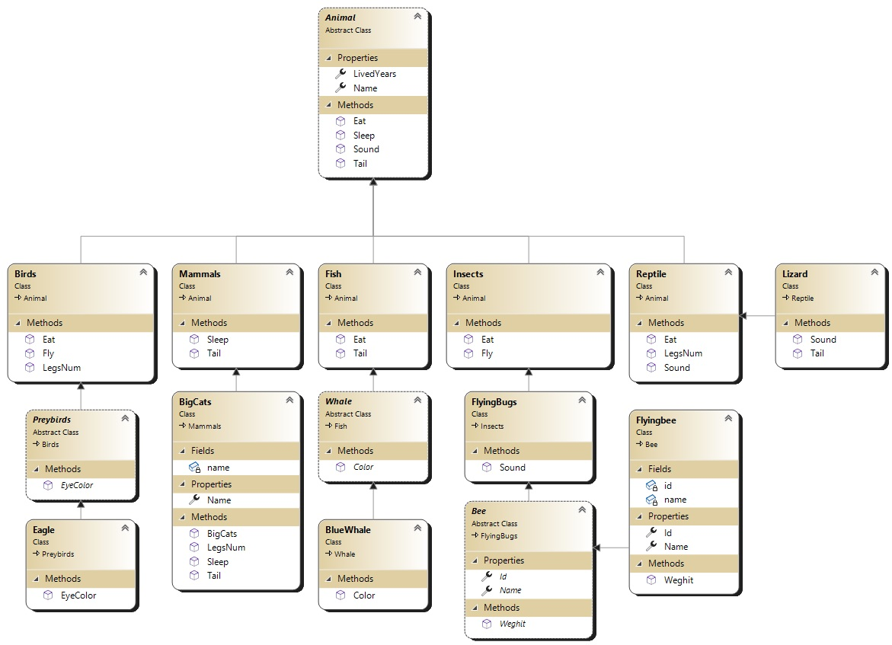
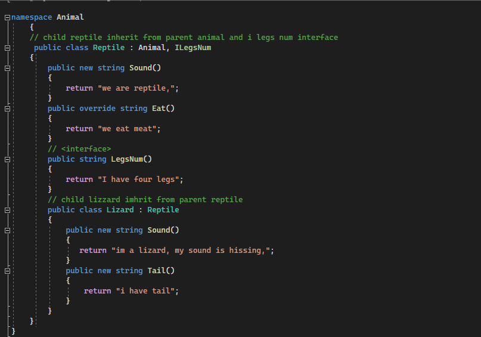
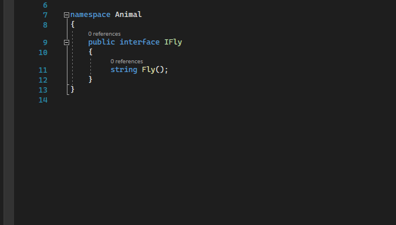
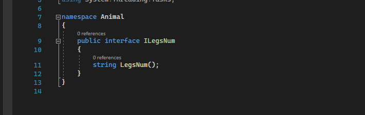
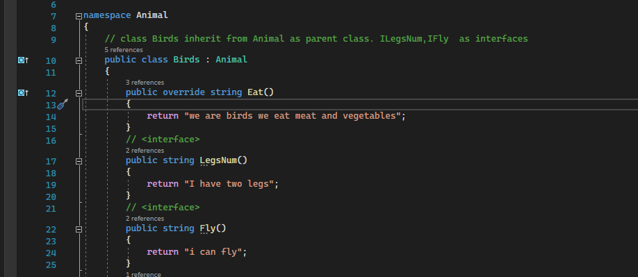
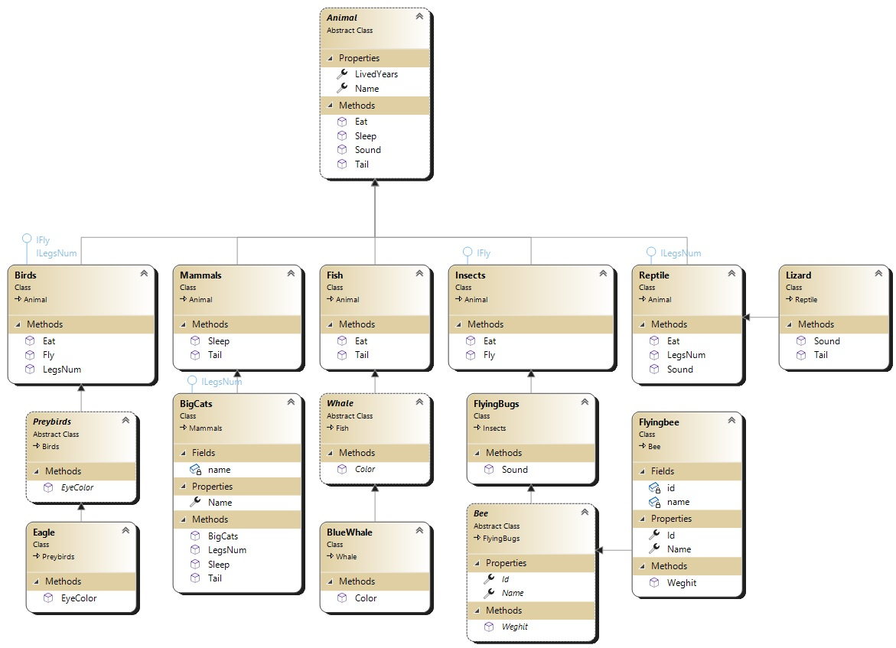

### Lab06-OOPPrinciples
#### A zoo contains animals, and animals come in many different shapes and sizes. this project provide an implementation on oop principles(inheritance,abstraction,polymorphism,encapsulation) , and provide implementation on interfaces

### Digital UML drawing of zoo

### OOP principles

### Inheritance: classes that reuse, we can take specifications from class marked as parent and we can modify om these specifications

### Ecncapsulation to keep our data in safe, and to hide important data.

### polymorphism: many forms for one method, each child class define this method according to its behaviour

### Abstraction: prevent direct instantiation,used only if a new class is derived from it  

### Interface: blueprint of a class. It is like abstract class because all the methods which are declared inside the interface are abstract methods.

### interface that will return a string (i can fly)

### interface that will return a string (i have four legs)

### interface implementation

### Updated diagram with interfaces mapped out.

